# Things I want to learn in 2025

This year, my focus is on exploring the intersection of neuroscience and AI. I'll be diving deep into textbooks and hands-on projects to better understand both the human brain and artificial intelligence. The following lists outline the books, textbooks, and codebases that I'm currently reading and coding from.

```mermaid
graph TD
    %% Mathematical Foundations (Base Layer)
    math["Mathematics for Machine Learning"]
    stats["An Introduction to Statistical Learning"]
    prob["Probabilistic Machine Learning"]
    bayes["Bayesian Reasoning and Machine Learning"]
    
    %% Core AI Foundations
    aimodern["AI: A Modern Approach"]
    aihistory["AI: From Medieval Robots to Neural Networks"]
    profiles["Profiles of the Future"]
    
    %% Learning & Neuroscience
    howlearn["How We Learn"]
    artlearn["Art of Doing Science and Engineering"]
    
    %% ML Fundamentals
    mlintro["Introduction to Machine Learning"]
    hundred["The Hundred-Page ML Book"]
    grokking["Grokking Machine Learning"]
    foundations["Foundations of Machine Learning"]
    
    %% Deep Learning Theory
    littlebook["The Little Book of Deep Learning"]
    dlconcepts["Deep Learning: Foundations and Concepts"]
    dlgoodfellow["Deep Learning (Goodfellow)"]
    understanding["Understanding Deep Learning"]
    principles["Principles of Deep Learning Theory"]
    neural["Neural Networks and Deep Learning"]
    
    %% Practical Deep Learning
    dlcoders["Deep Learning for Coders with Fastai"]
    dlscratch["Deep Learning from Scratch"]
    nnpython["Neural Networks from Scratch in Python"]
    dlpython["Deep Learning with Python"]
    pytorch["Machine Learning with PyTorch and Scikit-Learn"]
    dive["Dive into Deep Learning"]
    
    %% AI Engineering & Systems
    aieng["AI Engineering: Building Applications"]
    mlsystems["Designing Machine Learning Systems"]
    
    %% AI Safety & Ethics
    aisafety["Introduction to AI Safety, Ethics and Society"]
    alignment["The Alignment Problem"]
    compatible["Human Compatible"]
    
    %% AI Future & Philosophy
    paths["Paths, Dangers, Strategies"]
    life3["Life 3.0"]
    worlds["The Worlds I See"]
    singularity["The Singularity Is Nearer"]
    
    %% Specialized Topics
    rl["Reinforcement Learning: An Introduction"]
    marl["Multi-agent Reinforcement Learning"]
    parallel["Programming Massively Parallel Processors"]
    
    %% Code & Frameworks
    python["Python"]
    pytorchcode["PyTorch"]
    jax["JAX"]
    xla["XLA"]
    transformers["Transformers (HuggingFace)"]
    mlx["MLX"]
    mlxexamples["MLX Examples"]
    axlearn["axlearn"]
    tinygrad["tinygrad"]
    ggml["ggml"]
    triton["Triton"]
    cuda["CUDA"]
    gpupuzzles["GPU Puzzles"]
    nanogpt["nanoGPT"]
    micrograd["micrograd"]
    llmc["llm.c"]
    xtransformers["x-transformers"]
    
    %% Core Dependencies
    math --> stats
    math --> prob
    math --> bayes
    math --> mlintro
    math --> foundations
    
    profiles --> aihistory
    aihistory --> aimodern
    aimodern --> mlintro
    aimodern --> aisafety
    
    howlearn --> artlearn
    artlearn --> mlintro
    
    %% ML to DL progression
    mlintro --> hundred
    hundred --> grokking
    mlintro --> foundations
    foundations --> littlebook
    
    stats --> dlconcepts
    prob --> dlconcepts
    bayes --> dlgoodfellow
    
    littlebook --> understanding
    dlconcepts --> dlgoodfellow
    dlgoodfellow --> principles
    dlgoodfellow --> neural
    neural --> understanding
    
    %% Theory to Practice
    littlebook --> dlcoders
    neural --> dlscratch
    neural --> nnpython
    dlconcepts --> dlpython
    dlconcepts --> pytorch
    understanding --> dive
    
    %% AI Engineering connections
    aimodern --> aieng
    dlpython --> aieng
    mlintro --> mlsystems
    aieng --> mlsystems
    
    %% Safety and Future
    aimodern --> paths
    paths --> life3
    paths --> compatible
    compatible --> alignment
    aisafety --> alignment
    aieng --> aisafety
    howlearn --> worlds
    life3 --> singularity
    worlds --> singularity
    
    %% Specialized topics
    foundations --> rl
    rl --> marl
    dlgoodfellow --> parallel
    
    %% Code implementations
    python --> pytorchcode
    python --> jax
    pytorchcode --> xla
    pytorchcode --> transformers
    pytorchcode --> triton
    jax --> xla
    
    dlscratch --> micrograd
    micrograd --> tinygrad
    nnpython --> micrograd
    
    dlcoders --> nanogpt
    transformers --> nanogpt
    nanogpt --> llmc
    transformers --> xtransformers
    
    python --> mlx
    mlx --> mlxexamples
    mlx --> axlearn
    jax --> axlearn
    
    parallel --> cuda
    cuda --> triton
    cuda --> gpupuzzles
    triton --> tinygrad
    
    dlpython --> ggml
    ggml --> llmc
    
    %% Connecting practice to code
    pytorch --> pytorchcode
    dlcoders --> pytorchcode
    dive --> jax
    dive --> pytorchcode
    
    %% Ensuring all nodes are connected
    aieng --> transformers
    mlsystems --> tinygrad
    principles --> xtransformers
```

<!-- more -->

## Books

### AI History & Future
- [x] Profiles of the Future [@clarke2013profiles]
- [x] Artificial Intelligence: From Medieval Robots to Neural Networks [@pickover2019artificial]
- [x] Paths, Dangers, Strategies [@bostrom2014paths]
- [ ] Life 3.0: Being Human in the Age of Artificial Intelligence [@tegmark2018life]
- [ ] Human Compatible: AI and the Problem of Control [@russell2019human]
- [ ] The Alignment Problem: How Can Machines Learn Human Values? [@christian2021alignment]
- [ ] The Worlds I See: Curiosity, Exploration, and Discovery at the Dawn of AI [@li2023worlds]
- [ ] The Singularity Is Nearer: When We Merge with AI [@kurzweil2024singularity]

### Neuroscience & Learning
- [x] How we learn: Why brains learn better than any machine... for now [@dehaene2021we]
- [ ] Art of Doing Science and Engineering: Learning to Learn [@hamming1997art]

## Textbooks

### AI & ML Fundamentals
- [x] AI Engineering: Building Applications with Foundation Models [@aiebook2025]
- [x] Artificial Intelligence: A Modern Approach [@russell2020artificial]
- [ ] Introduction to AI Safety, Ethics and Society [@hendrycks2024introduction]

### Deep Learning Theory & Practice
- [x] The Little Book of Deep Learning [@fleuret2023little]
- [x] Deep Learning: Foundations and Concepts [@bishop2024deep]
- [ ] Neural Networks and Deep Learning [@nielsen2015neural]
- [ ] Deep Learning [@goodfellow2016deep]
- [ ] Understanding Deep Learning [@prince2023understanding]
- [ ] Dive into Deep Learning [@zhang2023dive]
- [ ] The Principles of Deep Learning Theory [@roberts2022principles]

### Machine Learning Hands-On
- [ ] Deep Learning for Coders with Fastai and PyTorch: AI Applications Without a PhD [@howard2020deep]
- [ ] Deep Learning from Scratch: Building with Python from First Principles [@weidman2019deep]
- [ ] Neural Networks from Scratch in Python: Building Neural Networks in Raw Python [@kinsley2020neural]
- [ ] Deep Learning with Python [@chollet2021deep]
- [ ] Machine Learning with PyTorch and Scikit-Learn: Develop Machine Learning and Deep Learning Models with Python [@raschka2022machine]

### Mathematical Foundations
- [ ] An Introduction to Statistical Learning: With Applications in Python [@james2023introduction]
- [ ] Mathematics for Machine Learning [@deisenroth2020mathematics]
- [ ] Bayesian Reasoning and Machine Learning [@barber2012bayesian]
- [ ] Probabilistic Machine Learning: An Introduction [@murphy2022probabilistic]

### ML Systems & Engineering
- [ ] Designing Machine Learning Systems [@huyen2022designing]
- [ ] Foundations of Machine Learning [@mohri2018foundations]
- [ ] Introduction to Machine Learning [@alpaydin2020introduction]
- [ ] The Hundred-Page Machine Learning Book [@burkov2019hundred]
- [ ] Grokking Machine Learning [@serrano2021grokking]

### Reinforcement Learning
- [ ] Reinforcement Learning: An Introduction [@andrew2018reinforcement]
- [ ] Multi-agent Reinforcement Learning: Foundations and Modern Approaches [@albrecht2024multi]

### High-Performance Computing
- [ ] Programming Massively Parallel Processors: A Hands-on Approach [@kirk2016programming]

## Code

### Core Frameworks & Languages
- [ ] [Python] & [PyTorch] by Meta, [XLA] by Google
- [ ] [JAX] by Google DeepMind [@jax2018github]
- [ ] Transformers [@wolf-etal-2020-transformers] by [Hugging Face]

### Low-Level & Performance
- [ ] [tinygrad] by [tiny corp]
- [ ] [ggml] by Georgi Gerganov
- [ ] [Triton] by OpenAI [@tillet2019triton]
- [ ] [CUDA] by Nvidia & [GPU Puzzles] by Sasha Rush

### Educational Implementations
- [ ] [nanoGPT], [micrograd], & [llm.c] by Andrej Karpathy
- [ ] [x-transfomers] by Phil Wang (aka lucidrains)

### Apple Ecosystem
- [ ] [MLX] [@mlx2023], [MLX examples] & [axlearn] by Apple

[tinygrad]: https://github.com/tinygrad/tinygrad
[ggml]: https://github.com/ggerganov/ggml
[Python]: https://github.com/python/cpython
[PyTorch]: https://github.com/pytorch/pytorch
[JAX]: https://github.com/jax-ml/jax
[XLA]: https://github.com/pytorch/xla
[Triton]: https://github.com/triton-lang/triton
[CUDA]: https://github.com/NVIDIA/cuda-samples
[GPU Puzzles]: https://github.com/srush/GPU-Puzzles
[MLX]: https://github.com/ml-explore/mlx
[MLX examples]: https://github.com/ml-explore/mlx-examples
[axlearn]: https://github.com/apple/axlearn
[nanoGPT]: https://github.com/karpathy/nanoGPT
[micrograd]: https://github.com/karpathy/micrograd
[llm.c]: https://github.com/karpathy/llm.c
[tiny corp]: https://tinygrad.org
[Hugging Face]: https://github.com/huggingface
[x-transfomers]: https://github.com/lucidrains/x-transformers

## References