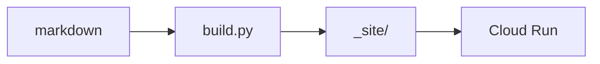

# Style guide

One page that exercises every element the template can set.

<!-- more -->

## Block elements

### Level three

#### Level four

##### Level five

###### Level six

**Bold**, _italic_, and **_bold italic_** in one run. <del>Struck through</del> stays quiet. The morph target is <mark>resampled on every page load</mark>, which is the bug.

An [inline link](https://olivares.cl), a <https://example.com/autolink>, and a reference — [Bishop][bishop].

[bishop]: https://www.amazon.com/dp/0387310738

> Everything should be built top-down, except the first time.
>
> Second paragraph inside the same quote.

- Unordered item
- Item with nesting
  - Nested one level
    - Nested two levels
- Last item

1. Ordered item
2. Item with nesting
   1. Nested ordered
   2. Sibling
3. Last item

Point sprite : A single `gl.POINTS` vertex, discarded outside a unit disc.

Arcball : Quaternion drag mapping screen delta to an axis-angle rotation.

Press <kbd>Ctrl</kbd>+<kbd>C</kbd> to abort; the program prints <samp>built 3 posts, 5 projects → \_site/</samp>. H<sub>2</sub>O, and E = mc<sup>2</sup>. The <abbr title="Graphics Processing Unit">GPU</abbr> is saturated.

<details markdown="1">
<summary>Show the derivation</summary>

A paragraph with `code`, then a list:

- one
- two

```js
const q = qnorm(qmul(qaxis(0, 1, 0, 0.0022), q));
```

</details>

## Code

Read the palette with `getComputedStyle(document.documentElement)`.

```python
def morph(a, b, t):
    return a * (1 - t) + b * t  # a $ in here is not math
```

```sh
docker run --rm -p 8000:8000 -e PORT=8000 --entrypoint granian olivares.cl --interface wsgi --host 0.0.0.0 --port 8000 server:app
```

A bare `pre` hangs half a module. Opt into the listing bay or the note channel the same way figures do:

```{.python .plate}
# pre.plate — listing bay, centred on the column
for shape in ("sphere", "torus", "helix"):
    print(shape, 4200)
```

```{.python .fullwidth}
# pre.fullwidth — listing bay plus the note channel
print("hang-l + reach-r")
```

## Table

Status marks colour a cell without shouting: <span class="mark-ok">✓</span> ok, <span class="mark-fail">✗</span> fail, <span class="mark-warn">✗</span> warn.

| Shape  | Points | Morph target |              Status              |
| ------ | -----: | :----------: | :------------------------------: |
| Sphere |   4200 |    Torus     |  <span class="mark-ok">✓</span>  |
| Torus  |   4200 |     none     | <span class="mark-warn">✗</span> |
| Helix  |   4200 |     none     | <span class="mark-fail">✗</span> |

---

## Media

Four widths share one centre line. A bare `figure` keeps the measure; a `figure.plate` opens half a module onto the field listings and section rules already use; a `figure.fullwidth` also spends the note channel; a `figure.margin` floats into that channel beside the prose.

<figure markdown="1">

<figcaption markdown="span">Fig. S1 — bare *figure*: measure width, caption in the note voice.</figcaption>
</figure>

<figure class="plate" markdown="1">
{: .screenshot }
<figcaption markdown="span">Fig. S2 — the *plate*, with a **bold** run.</figcaption>
</figure>

<figure class="fullwidth" markdown="1">
{: .screenshot }
<figcaption markdown="span">Fig. S3 — *fullwidth*: plate plus the note channel, so the caption drops underneath.</figcaption>
</figure>

<figure class="margin" markdown="1">

<figcaption markdown="span">Fig. S4 — a *margin figure*: a picture in the note voice, out in the channel.</figcaption>
</figure>

A margin figure sits beside this paragraph rather than interrupting it, which is where a picture belongs when it is evidence for a sentence and not the subject of the section. It shares the channel with the sidenotes, so notes and small pictures queue down one column instead of two.

An embed has no intrinsic ratio, so `.iframe-wrapper` carries one (16/9 by default; override with `--ratio`):

<figure class="iframe-wrapper">
<iframe src="https://www.youtube.com/embed/QUry9dHC-bk" title="Tinygrad overview" loading="lazy" allowfullscreen></iframe>
</figure>

## Interactives

Two runtimes. `fig3d` is the WebGL point-cloud morph; `[data-fig]` mounts a canvas component from `fig-core.js` (same plate bay as tables and listings). The lab page holds the full catalog — one of each here is enough to catch a layout or script regression.

<figure class="fig3d">
<canvas data-shape="sphere" data-morph-to="torus"></canvas>
<input type="range" min="0" max="1000" value="0" aria-label="Morph sphere into torus">
<figcaption>Fig. S5 — Fibonacci sphere ⇄ torus · drag to rotate · slider to morph</figcaption>
</figure>
<noscript><p class="meta">Fig. S5 needs WebGL.</p></noscript>

<div data-fig="wave" data-height="220"></div>

## Mermaid

A fenced `mermaid` block becomes `figure.mermaid` on the measure; wide graphs scroll rather than blow the column.



## Math

Inline: $\mathcal{L} = -\sum_k y_k \log \hat{y}_k$ with $w_i \in \mathbb{R}^{d}$.

$$
\hat{y} = \sigma\!\left(\sum_{i=1}^{n} w_i x_i + b\right)
$$

A Push 3 costs \$2,000 — escaped, so KaTeX leaves it alone.

## Footnotes and citations

Point sprites are cheaper than instanced quads.[^sprites]

Smarty typography: straight quotes "become curly", an em dash --- like so, a numeric range 30--40, an ellipsis... and it's got apostrophes.

Bishop remains the reference for the classical view [@bishop2006pattern], and the deep-learning successor updates it [@goodfellow2016deep].

[^sprites]: One vertex, one fragment, no index buffer. See [fig.js](/static/fig.js).

## Dates

Shipped <time datetime="2026-08-21" data-rel-from="2026-08-21T00:00:00">21 August 2026</time> — relative by default; hover for the exact date.
