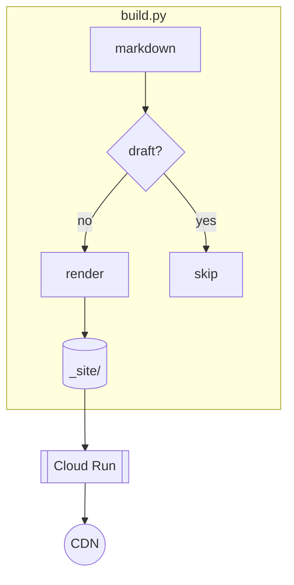
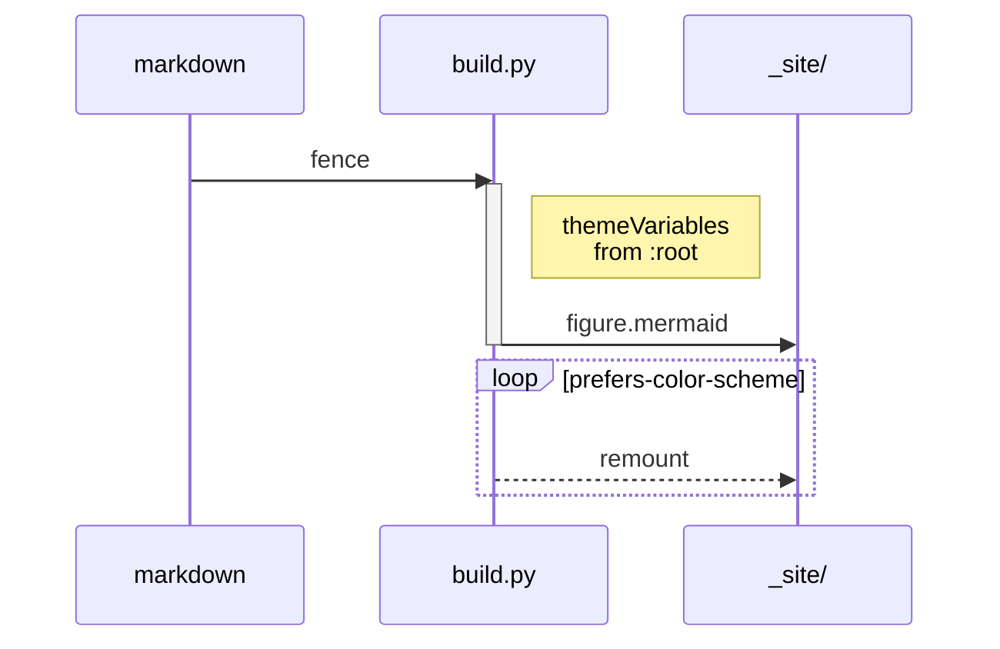
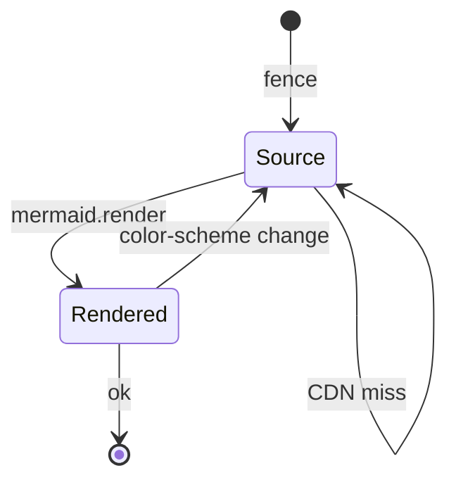
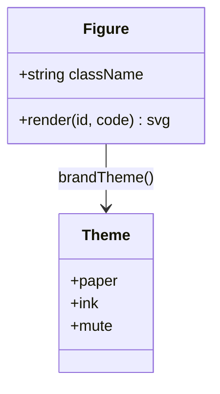
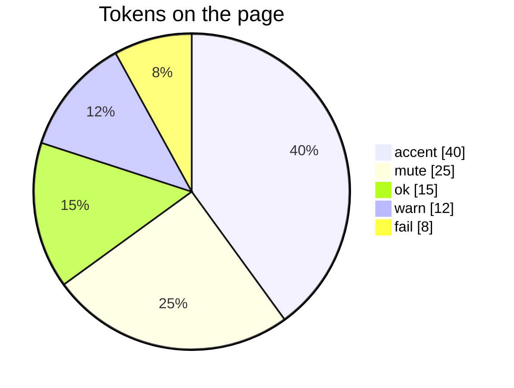

# Style guide

One page that exercises every element the template can set.

<!-- more -->

## Block elements

### Level three

#### Level four

##### Level five

###### Level six

**Bold**, _italic_, and **_bold italic_** in one run. <del>Struck through</del> stays quiet. The morph target is <mark>resampled on every page load</mark>, which is the bug.

An [inline link](https://olivares.cl), a <https://example.com/autolink>, and a reference — [Bishop][bishop].

[bishop]: https://www.amazon.com/dp/0387310738

> Everything should be built top-down, except the first time.
>
> Second paragraph inside the same quote.

- Unordered item
- Item with nesting
  - Nested one level
    - Nested two levels
- Last item

1. Ordered item
2. Item with nesting
   1. Nested ordered
   2. Sibling
3. Last item

Point sprite : A single `gl.POINTS` vertex, discarded outside a unit disc.

Arcball : Quaternion drag mapping screen delta to an axis-angle rotation.

Press <kbd>Ctrl</kbd>+<kbd>C</kbd> to abort; the program prints <samp>built 3 posts, 5 projects → \_site/</samp>. H<sub>2</sub>O, and E = mc<sup>2</sup>. The <abbr title="Graphics Processing Unit">GPU</abbr> is saturated.

<details markdown="1">
<summary>Show the derivation</summary>

A paragraph with `code`, then a list:

- one
- two

```js
const q = qnorm(qmul(qaxis(0, 1, 0, 0.0022), q));
```

</details>

<p class="section-label">Editorial</p>

## Dual section titles

A muted mono `.section-label` over a serif `h2` — the label owns the field hairline so the pair reads as one composition. Authors can also wrap both in `<header class="section-head">`.

<aside class="findings" aria-label="Key findings">
<p class="section-label">Findings</p>
<p>This page’s editorial primitives deliver two results an author can reuse without inventing chrome.</p>
<ul class="claim-list">
<li><strong>Dual titles.</strong> A mono secondary label plus the existing section head, without a second rule.</li>
<li><strong>Gallery plates.</strong> Caption-bound slides with scroll-snap, dots, and keyboard, still on the plate bay.</li>
</ul>
</aside>

## Code

Read the palette with `getComputedStyle(document.documentElement)`. Token tour: keywords (teal mix + weight), strings (rose), numbers/bools (warn), types/builtins (accent), decorators (ok), comments (mute).

Preferred fence and chip languages: `python`, `json`, `html`, `bash`, `zsh`, `curl`. (`curl` / `zsh` / `sh` colour as bash.) Other langs still work; these are the ones the palette is tuned for.

### Inline chips

Bare backticks stay a wash chip — good for paths and ids: `src/static/style.css`, `0x2982`. Opt into the same Pygments tokens with a mock shebang inside the backticks:

- Python: `:::python print("hi") + 1`
- JSON: `:::json {"ok": true, "n": 2}`
- HTML: `:::html <span class="mark-ok">✓</span>`
- Bash: `:::bash export PORT=8000`
- Zsh: `:::zsh print -l ${(k)path}`
- Curl: `:::curl curl -sS -I https://example.com`
- Unknown langs drop the marker: `:::notalang foo()` → plain `foo()`

### Fences

Python — full token tour:

```python
# -*- coding: utf-8 -*-
"""Module docstring — String.Doc, then every other token the plate cares about."""
from __future__ import annotations

import asyncio
import re
from collections.abc import AsyncIterator, Callable, Mapping
from dataclasses import dataclass, field
from enum import Enum, auto
from pathlib import Path
from typing import ClassVar, Final, Literal, Self, TypeVar, overload

π: Final[float] = 3.141592653589793  # Name + float
HEX, BIN, OCT = 0xDEAD_BEEF, 0b1010_1100, 0o755
COMPLEX = 1.5 + 2j
TRUE, FALSE, NONE = True, False, None  # Keyword.Constant → warn (amber)

T = TypeVar("T")
Kind = Literal["sphere", "torus", "helix"]

@dataclass(slots=True, frozen=True)
class Sample[T]:
    """Generic dataclass — class keyword, Name.Class, decorators."""

    name: str
    payload: T
    tags: tuple[str, ...] = ()
    meta: Mapping[str, object] = field(default_factory=dict)
    _cache: ClassVar[dict[str, Self]] = {}

    def __post_init__(self) -> None:
        if not self.name:  # Operator.Word: not / and / or / in / is
            raise ValueError(f"empty name for {self!r}")
```

Bash:

```bash
#!/usr/bin/env bash
set -euo pipefail
export PORT="${PORT:-8000}"
docker run --rm -p "$PORT:$PORT" -e PORT \
  --entrypoint granian olivares.cl \
  --interface wsgi --host 0.0.0.0 --port "$PORT" server:app
```

Zsh (same BashLexer as `bash` / `curl`):

```zsh
#!/usr/bin/env zsh
typeset -U path
path=(~/.local/bin $path)
print -l ${(k)commands} | rg '^python'
```

Curl (aliased to bash):

```curl
curl -sS -X POST 'https://api.example.com/v1/chat' \
  -H 'Accept: application/json' \
  -H "Authorization: Bearer $TOKEN" \
  -d '{"model":"gpt-4.1","messages":[{"role":"user","content":"ping"}]}'
```

JSON:

```json
{
  "ok": true,
  "status": 200,
  "data": {"id": "msg_01", "tokens": 12},
  "errors": null
}
```

HTML:

```html
<figure class="plate">
  
  <figcaption>
    Caption voice.
  </figcaption>
</figure>
```

A bare `pre` / `div.highlight` hangs half a module. The same three width
tiers apply to figures, listings, and tables — one vocabulary, not three:

| Class | Width |
| --- | --- |
| `.compact` | Measure (undo the default hang; denser padding) |
| `.plate` | Listing bay |
| `.fullwidth` | Bay + note channel |

```{.python .compact}
# .compact — on the measure, tighter pad
print("measure")
```

```{.python .plate}
# .plate — listing bay, centred on the column
for shape in ("sphere", "torus", "helix"):
    print(shape, 4200)
```

```{.python .fullwidth}
# .fullwidth — listing bay plus the note channel
print("hang-l + reach-r")
```

## Table

The same `.compact` / `.plate` / `.fullwidth` tiers. Narrow tables stay on
the **measure**; five or more columns — or `class="plate"` — open the
**listing bay**; `class="fullwidth"` spends the note channel. Column heads
are mono micro-labels; the first body cell becomes a stub
`th[scope="row"]` (sticky when a bay scrolls). Column alignment is the
colon dance — `------` left, `-----:` right, `:----:` centre. On the
measure, prose cells may wrap; stubs, heads, and right-aligned (numeric)
cells stay one line. Bay tables keep every cell one line and scroll
instead. Status marks colour a cell without shouting:
<span class="mark-ok">✓</span> ok, <span class="mark-fail">✗</span> fail,
<span class="mark-warn">✗</span> warn.

### Default (measure)

Bare pipe table — on the prose measure, textbook frame. `Points` is
right-aligned (`-----:`); `Morph target` and `Status` are centred (`:----:`).
Prose in a body cell may wrap; the stub and the numeric column stay one line.

| Shape  | Points | Note                                                         | Status |
| ------ | -----: | ------------------------------------------------------------ | :----: |
| Sphere |   4200 | Morphs toward a torus; the long note wraps inside the measure. | <span class="mark-ok">✓</span> |
| Torus  |   4200 | No morph target yet.                                         | <span class="mark-warn">✗</span> |
| Helix  |   4200 | No morph target yet.                                         | <span class="mark-fail">✗</span> |
| Plane  |   4200 | Morphs toward a sphere.                                      | <span class="mark-ok">✓</span> |

### Compact + caption

A caption is ordinary HTML on the table. Dense grids opt into
`class="compact"` — same measure, tighter rhythm.

<table class="compact">
<caption>Table S1 — compact rhythm on the measure.</caption>
<thead>
<tr>
<th>Provider</th>
<th style="text-align: right;">Context</th>
<th style="text-align: right;">In</th>
<th style="text-align: right;">Out</th>
</tr>
</thead>
<tbody>
<tr>
<td>chutes</td>
<td style="text-align: right;">262,144</td>
<td style="text-align: right;">0.35</td>
<td style="text-align: right;">2.75</td>
</tr>
<tr>
<td>venice</td>
<td style="text-align: right;">262,144</td>
<td style="text-align: right;">0.45</td>
<td style="text-align: right;">3.20</td>
</tr>
<tr>
<td>alibaba</td>
<td style="text-align: right;">1,000,000</td>
<td style="text-align: right;">0.425</td>
<td style="text-align: right;">2.55</td>
</tr>
</tbody>
</table>

### Plate (listing bay)

Five or more columns auto-open the listing bay (or pass `class="plate"`).
Same hang as `figure.plate` / code plates; the stub freezes when the bay
scrolls.

| Provider   | Quant   |     Context |    Max out | In (USD/M) | Out (USD/M) | Cache-read | Up 30m |
| ---------- | ------- | ----------: | ---------: | ---------: | ----------: | ---------: | -----: |
| chutes     | fp8     |     262,144 |     65,536 |       0.35 |        2.75 |      0.035 |   97.0 |
| coreweave  | fp8     |     262,144 |    262,144 |       0.40 |        3.00 |       0.15 |   96.3 |
| akashml    | bf16    |     262,144 |    131,072 |       0.40 |        3.00 |       0.05 |   99.8 |
| alibaba    | unknown |   1,000,000 |    131,072 |      0.425 |        2.55 |      0.085 |  100.0 |
| **venice** | **fp8** | **262,144** | **65,536** |   **0.45** |    **3.20** |        n/a |   98.9 |

### Fullwidth

`class="fullwidth"` lifts onto the scroll bay at build — listing hang plus
the note channel, same edges as `figure.fullwidth` / `pre.fullwidth`.

<table class="fullwidth compact">
<caption>Table S2 — fullwidth: hang + note channel.</caption>
<thead>
<tr>
<th>Engine / route</th>
<th>Result</th>
<th style="text-align: right;">Tokens</th>
<th style="text-align: right;">Cost</th>
<th>Router saw</th>
</tr>
</thead>
<tbody>
<tr>
<td><code>native</code> @ venice</td>
<td><span class="mark-ok">✓</span> correct</td>
<td style="text-align: right;">5,272</td>
<td style="text-align: right;">$0.0028</td>
<td>Venice, no parser</td>
</tr>
<tr>
<td><code>plugins</code> omitted</td>
<td><span class="mark-ok">✓</span> OCR path</td>
<td style="text-align: right;">2,545</td>
<td style="text-align: right;">$0.0034</td>
<td>CoreWeave, mistral-ocr</td>
</tr>
<tr>
<td><code>cloudflare-ai</code></td>
<td><span class="mark-warn">✗</span> bypass</td>
<td style="text-align: right;">5,272</td>
<td style="text-align: right;">$0.0027</td>
<td>Venice native after 9× 400</td>
</tr>
<tr>
<td><code>mistral-ocr</code></td>
<td><span class="mark-fail">✗</span> same bypass</td>
<td style="text-align: right;">5,272</td>
<td style="text-align: right;">$0.0027</td>
<td>Venice native</td>
</tr>
</tbody>
</table>

---

## Media

Four widths share one centre line. A bare `figure` keeps the measure; a `figure.plate` opens half a module onto the field listings and section rules already use; a `figure.fullwidth` also spends the note channel; a `figure.margin` floats into that channel beside the prose.

<figure markdown="1">

<figcaption markdown="span">Fig. S1 — bare *figure*: measure width, caption in the note voice.</figcaption>
</figure>

<figure class="plate" markdown="1">
{: .screenshot }
<figcaption markdown="span">Fig. S2 — the *plate*, with a **bold** run.</figcaption>
</figure>

<figure class="fullwidth" markdown="1">
{: .screenshot }
<figcaption markdown="span">Fig. S3 — *fullwidth*: plate plus the note channel, so the caption drops underneath.</figcaption>
</figure>

<figure class="margin" markdown="1">

<figcaption markdown="span">Fig. S4 — a *margin figure*: a picture in the note voice, out in the channel.</figcaption>
</figure>

A margin figure sits beside this paragraph rather than interrupting it, which is where a picture belongs when it is evidence for a sentence and not the subject of the section. It shares the channel with the sidenotes, so notes and small pictures queue down one column instead of two.

### Figure gallery

A `figure.plate.gallery` is a caption-bound slide stack: one locked bay sized from the first plate (contain-fit — scale hits max width or max height first), every later slide letterboxes into that frame, dots and Prev/Next in the mono voice, and a Hilbert-curve WebGL wipe between contain-fitted plates (instant cut under `prefers-reduced-motion`). Focus the gallery and use the arrow keys.

<figure class="plate gallery plate-reveal" aria-label="Three plates from the site">
  <div class="gallery-viewport">
    <div class="gallery-track">
      <div class="gallery-slide">
        
        <span class="gallery-slide-caption">Fig. G1 — Rembrandt hatching as the reference plate for the engraving shader.</span>
      </div>
      <div class="gallery-slide">
        
        <span class="gallery-slide-caption">Fig. G2 — The TexTube plugin card: four sample prompts on a white UI plate.</span>
      </div>
      <div class="gallery-slide">
        
        <span class="gallery-slide-caption">Fig. G3 — The 1948 Universal Declaration as a born-digital document plate.</span>
      </div>
    </div>
  </div>
  <figcaption>
    <span class="gallery-live-caption" aria-live="polite"></span>
  </figcaption>
</figure>

An embed has no intrinsic ratio, so `.iframe-wrapper` carries one (16/9 by default; override with `--ratio`). YouTube uses a lite facade (`data-youtube`) — poster until click:

<figure class="iframe-wrapper" data-youtube="QUry9dHC-bk" data-title="Tinygrad overview"></figure>

## Interactives

Two runtimes. `fig3d` is the WebGL point-cloud morph; `[data-fig]` mounts a canvas component from `fig-core.js` (same plate bay as tables and listings). The lab page holds the full catalog — one of each here is enough to catch a layout or script regression.

<figure class="fig3d">
<canvas data-shape="sphere" data-morph-to="torus"></canvas>
<input type="range" min="0" max="1000" value="0" aria-label="Morph sphere into torus">
<figcaption>Fig. S5 — Fibonacci sphere ⇄ torus · drag to rotate · slider to morph</figcaption>
</figure>
<noscript><p class="meta">Fig. S5 needs WebGL.</p></noscript>

<div data-fig="wave" data-height="220"></div>

## Mermaid

A fenced `mermaid` block becomes `figure.mermaid` on the listing bay (same hang as bare `pre`); graphs wider than that bay scroll. Paper nodes, mute outlines, and JetBrains Mono labels — the same plate voice as tables and `kbd`, not Mermaid's default/dark themes.

### Flowchart

Shapes, a decision, edge labels, and a dashed cluster.



### Sequence

Actors, notes, loops, and activation.



### State



### Class



### Pie



## Math

Inline: $\mathcal{L} = -\sum_k y_k \log \hat{y}_k$ with $w_i \in \mathbb{R}^{d}$.

$$
\hat{y} = \sigma\!\left(\sum_{i=1}^{n} w_i x_i + b\right)
$$

A Push 3 costs \$2,000 — escaped, so KaTeX leaves it alone.

## Footnotes and citations

Hand-written notes use the Markdown footnote form. Point sprites are cheaper than instanced quads.[^sprites]

Smarty typography: straight quotes "become curly", an em dash --- like so, a numeric range 30--40, an ellipsis... and it's got apostrophes.

Bibliographic cites use `[@key]`. Keys resolve from `src/references.bib` at build time — the same file the README lists. On a wide viewport the note rides the margin; below 1152px the marker jumps to the Notes list at the end of the page. Bishop remains the reference for the classical view [@bishop2006pattern], and the deep-learning successor updates it [@goodfellow2016deep].

Murphy’s introduction is the probabilistic counterpart [@murphy2022probabilistic].

```bibtex
@book{bishop2006pattern,
  author    = {Bishop, Christopher M and Nasrabadi, Nasser M},
  publisher = {Springer},
  title     = {Pattern recognition and machine learning},
  year      = {2006}
}
```

[^sprites]: One vertex, one fragment, no index buffer. See [fig.js](/static/fig.js).

## Dates

Shipped <time datetime="2026-08-21" data-rel-from="2026-08-21T00:00:00">21 August 2026</time> — relative by default; hover for the exact date.
