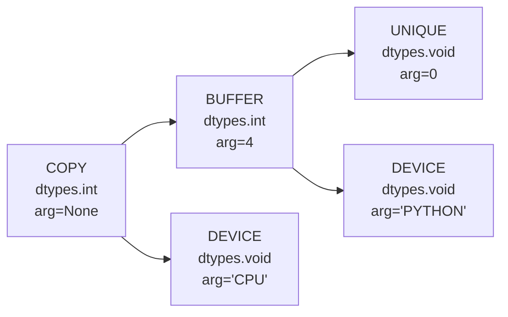
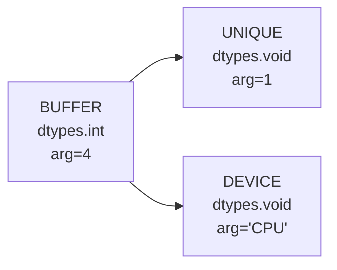
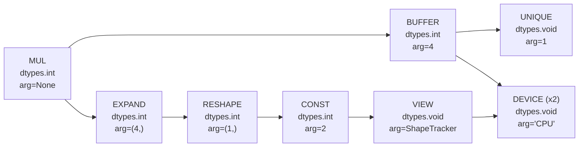
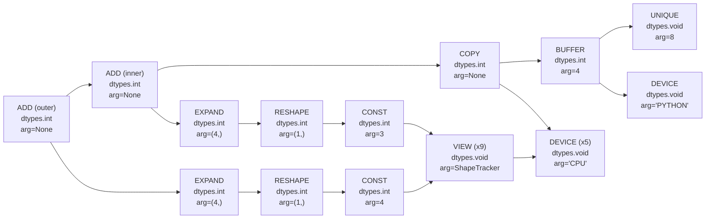
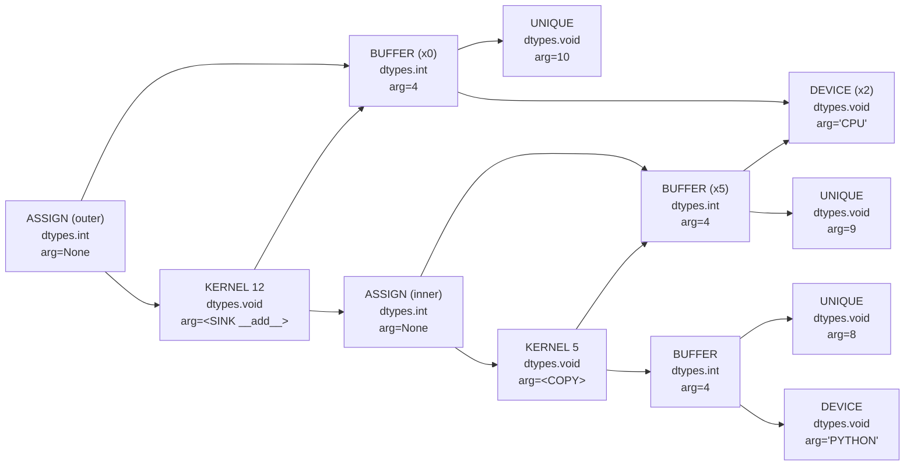
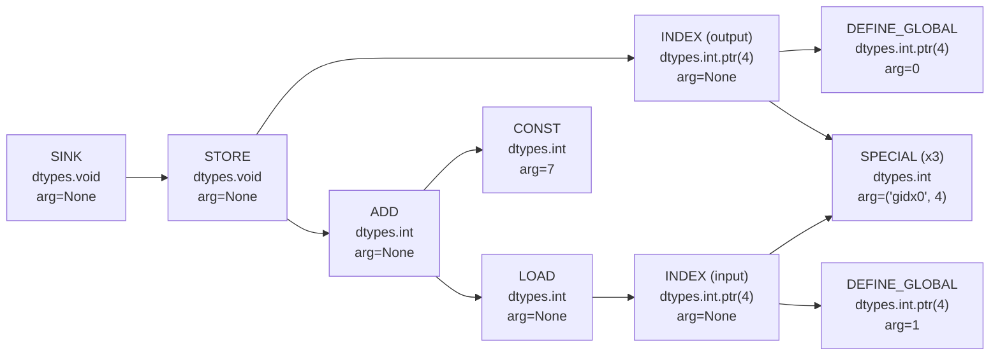

# Introduction to Tinygrad

Tinygrad is hard to read, even if you already live in autograd. Karpathy has said as much. This is my first pass at it: documentation, livestreams, and the parts of the source that actually matter, in one place.

<!-- more -->

<iframe width="720" height="320" src="https://www.youtube.com/embed/QUry9dHC-bk" title="Tinygrad overview" loading="lazy" allowfullscreen></iframe>

## Why Tinygrad?

It does not look like [PyTorch], [JAX], or [TensorFlow], and that is the point. The stated mission is to democratize the petaflop: a compiler small enough that a handful of people can hold the whole thing in their heads.

[PyTorch]: https://pytorch.org/
[JAX]: https://jax.readthedocs.io/en/latest/index.html
[TensorFlow]: https://www.tensorflow.org/

What I like:

1. Fully open source — including the hiring process, which is a story of its own
2. No dependencies
3. Multiple backends
4. A genuinely small codebase

What I still don't:

1. Steep, and not kind to beginners
2. The source is dense
3. Docs lag; some examples are broken
4. The API is not stable yet

That is enough throat-clearing. Here is the model.

## Installation

Tinygrad is meant to be hacked. Install it editable so a change in the clone is a change in the import:

```bash
git clone https://github.com/tinygrad/tinygrad.git
cd tinygrad
python3 -m pip install -e .
```

## The Tensor

The surface looks like PyTorch on purpose:

```python
from tinygrad import Tensor

t = Tensor([1, 2, 3, 4])
print(t)

# Basic operations work as expected
doubled = t * 2
print(doubled.tolist())  # [2, 4, 6, 8]

# More complex operations
result = t + 3 + 4
print(result.tolist())   # [8, 10, 12, 14]
```

Familiar API, different machine underneath.

## The Devices

A Device is where a tensor lives and where kernels run: CPU, CUDA, METAL, and others. On Apple Silicon the default is METAL:

```python
from tinygrad import Device

print(Device.DEFAULT)  # On Apple Silicon Mac: "METAL"
```

Tinygrad picks the fastest backend it can see. You can override it:

```python
Device.DEFAULT = "CPU"
print(Device.DEFAULT)  # "CPU"
```

The same Python then runs on whatever you pointed it at.

## Lazy Evaluation

Nothing has been computed yet:

```python
from tinygrad import Tensor, dtypes

t = Tensor([1, 2, 3, 4])

# Examine the tensor properties
assert t.device == Device.DEFAULT
assert t.dtype == dtypes.int
assert t.shape == (4,)

print(t)
# <Tensor <UOp CPU (4,) int (<Ops.COPY: 7>, None)> on CPU with grad None>
```

Tinygrad is lazy. A Tensor is a *specification* of work — a chain of UOps — not a buffer of results. Execution waits until you ask.

## The UOP

UOps (micro-operations) are the IR. They are immutable and form a [DAG](https://en.wikipedia.org/wiki/Directed_acyclic_graph). Each node has an op, a dtype, an argument, and sources.

```python
print(t.uop)
```

You get something like:

```python
UOp(Ops.COPY, dtypes.int, arg=None, src=(
  UOp(Ops.BUFFER, dtypes.int, arg=4, src=(
    UOp(Ops.UNIQUE, dtypes.void, arg=0, src=()),
    UOp(Ops.DEVICE, dtypes.void, arg='PYTHON', src=()),)),
  UOp(Ops.DEVICE, dtypes.void, arg='CPU', src=()),))
```

That tree is a COPY from a BUFFER on the PYTHON device (the list `[1, 2, 3, 4]`) onto CPU. The UNIQUE id pins that buffer so nothing else can be confused with it.


```mermaid
flowchart LR
    A["COPY<br/>dtypes.int<br/>arg=None"]
    B["BUFFER<br/>dtypes.int<br/>arg=4"]
    C["UNIQUE<br/>dtypes.void<br/>arg=0"]
    D["DEVICE<br/>dtypes.void<br/>arg='PYTHON'"]
    E["DEVICE<br/>dtypes.void<br/>arg='CPU'"]

    A --> B
    A --> E
    B --> C
    B --> D
```

## Realization

`realize()` runs the spec:

```python
t.realize()
print(t.uop)
```

After that, the COPY is gone. You are looking at a BUFFER:

```python
UOp(Ops.BUFFER, dtypes.int, arg=4, src=(
  UOp(Ops.UNIQUE, dtypes.void, arg=1, src=()),
  UOp(Ops.DEVICE, dtypes.void, arg='CPU', src=()),))
```


```mermaid
flowchart LR
    A["BUFFER<br/>dtypes.int<br/>arg=4"]
    B["UNIQUE<br/>dtypes.void<br/>arg=1"]
    C["DEVICE<br/>dtypes.void<br/>arg='CPU'"]

    A --> B
    A --> C
```

UNIQUE moved from `arg=0` to `arg=1`: the data now exists as a new object on the target device.

## Operations build computation graphs

Arithmetic is more graph:

```python
t_times_2 = t * 2
print(t_times_2.uop)
```

Scalar multiply becomes an explicit broadcast:


```mermaid
flowchart LR
    A["MUL<br/>dtypes.int<br/>arg=None"]
    B["BUFFER<br/>dtypes.int<br/>arg=4"]
    C["UNIQUE<br/>dtypes.void<br/>arg=1"]
    D["DEVICE (x2)<br/>dtypes.void<br/>arg='CPU'"]
    E["EXPAND<br/>dtypes.int<br/>arg=(4,)"]
    F["RESHAPE<br/>dtypes.int<br/>arg=(1,)"]
    G["CONST<br/>dtypes.int<br/>arg=2"]
    H["VIEW<br/>dtypes.void<br/>arg=ShapeTracker"]

    A --> B
    A --> E
    B --> C
    B --> D
    E --> F
    F --> G
    G --> H
    H --> D
```

The `2` is RESHAPEd and EXPANDed to `(4,)`. Broadcasting is not a hidden NumPy trick here; it is a node the rewrite engine can see and fold.

```python
assert t_times_2.tolist() == [2, 4, 6, 8]
```

## Smart Deduplication

UOps are immutable and globally unique, so identical specs are the same object:

```python
A = t * 4
B = t * 4

# Different Python objects
assert A is not B

# Same computational specification
assert A.uop is B.uop
```

Realize one, and the other is already done:

```python
A.realize()

# Both tensors now point to the same realized buffer
assert A.uop is B.uop

print(B.tolist())  # [4, 8, 12, 16] - no computation needed
```

## Automatic Differentiation

Gradients are the same machinery. For $y = x^2 + 3x + 1$:

```python
x = Tensor([2.0], requires_grad=True)
y = x**2 + 3*x + 1
loss = y.sum()

print(x.item()) # 2.0
print(y.item()) # 4 + 6 + 1 = 11
```

$$\frac{dy}{dx} = 2x + 3$$

At $x = 2$:

$$\frac{dy}{dx}\bigg|_{x=2} = 2(2) + 3 = 7$$

```python
grad, = loss.gradient(x)
print(grad.item()) # 7.0
```

### Chain Rule

Tinygrad applies the chain rule without being asked. For $z = \log(x^2 + 1)$:

```python
x = Tensor([2.0], requires_grad=True)
z = (x**2 + 1).log()
loss = z.sum()

print(x.item()) # 2.0
print(z.item()) # log(2^2 + 1) = log(5) ≈ 1.6094378232955933
```

1. Let $z = \log(x^{2}+1)$. Set $g(x)=x^{2}+1$, so $z = \log(g(x))$.
2. $\frac{dz}{dx} = \frac{1}{g(x)} \cdot g'(x) = \frac{2x}{x^2+1}$
3. At $x=2$: $\frac{dz}{dx} = \frac{4}{5} = 0.8$

```python
grad, = loss.gradient(x)
print(grad.item()) # 0.8
```

## Graph Optimization and Kernel Generation

The interesting part is the rewrite. Start with `t + 3 + 4`:

```python
t = Tensor([1, 2, 3, 4])
t_plus_3_plus_4 = t + 3 + 4

print(t_plus_3_plus_4.uop)  # Shows addition of 3 and 4 separately
```


```mermaid
flowchart LR
    A["ADD (outer)<br/>dtypes.int<br/>arg=None"]
    B["ADD (inner)<br/>dtypes.int<br/>arg=None"]
    C["COPY<br/>dtypes.int<br/>arg=None"]
    D["BUFFER<br/>dtypes.int<br/>arg=4"]
    E["UNIQUE<br/>dtypes.void<br/>arg=8"]
    F["DEVICE<br/>dtypes.void<br/>arg='PYTHON'"]
    G["DEVICE (x5)<br/>dtypes.void<br/>arg='CPU'"]
    H["EXPAND<br/>dtypes.int<br/>arg=(4,)"]
    I["RESHAPE<br/>dtypes.int<br/>arg=(1,)"]
    J["CONST<br/>dtypes.int<br/>arg=3"]
    K["VIEW (x9)<br/>dtypes.void<br/>arg=ShapeTracker"]
    L["EXPAND<br/>dtypes.int<br/>arg=(4,)"]
    M["RESHAPE<br/>dtypes.int<br/>arg=(1,)"]
    N["CONST<br/>dtypes.int<br/>arg=4"]

    A --> B
    A --> L
    B --> C
    B --> H
    C --> D
    C --> G
    D --> E
    D --> F
    H --> I
    I --> J
    J --> K
    K --> G
    L --> M
    M --> N
    N --> K
```

Two ADD nodes. Then kernelize:

```python
t_plus_3_plus_4.kernelize()
print(t_plus_3_plus_4.uop)
```

Constant folding turns `+ 3 + 4` into `+ 7`:


```mermaid
flowchart LR
    A["ASSIGN (outer)<br/>dtypes.int<br/>arg=None"]
    B["BUFFER (x0)<br/>dtypes.int<br/>arg=4"]
    C["UNIQUE<br/>dtypes.void<br/>arg=10"]
    D["DEVICE (x2)<br/>dtypes.void<br/>arg='CPU'"]
    E["KERNEL 12<br/>dtypes.void<br/>arg=&lt;SINK __add__&gt;"]
    F["ASSIGN (inner)<br/>dtypes.int<br/>arg=None"]
    G["BUFFER (x5)<br/>dtypes.int<br/>arg=4"]
    H["UNIQUE<br/>dtypes.void<br/>arg=9"]
    I["KERNEL 5<br/>dtypes.void<br/>arg=&lt;COPY&gt;"]
    J["BUFFER<br/>dtypes.int<br/>arg=4"]
    K["UNIQUE<br/>dtypes.void<br/>arg=8"]
    L["DEVICE<br/>dtypes.void<br/>arg='PYTHON'"]

    A --> B
    A --> E
    B --> C
    B --> D
    E --> B
    E --> F
    F --> G
    F --> I
    G --> H
    G --> D
    I --> G
    I --> J
    J --> K
    J --> L
```

The kernel AST after rewrite:

```python
kernel_ast = t_plus_3_plus_4.uop.src[1].arg.ast

from tinygrad.codegen import full_rewrite_to_sink
rewritten_ast = full_rewrite_to_sink(kernel_ast)
print(rewritten_ast)
```


```mermaid
flowchart LR
    A["SINK<br/>dtypes.void<br/>arg=None"]
    B["STORE<br/>dtypes.void<br/>arg=None"]
    C["INDEX (output)<br/>dtypes.int.ptr(4)<br/>arg=None"]
    D["DEFINE_GLOBAL<br/>dtypes.int.ptr(4)<br/>arg=0"]
    E["SPECIAL (x3)<br/>dtypes.int<br/>arg=('gidx0', 4)"]
    F["ADD<br/>dtypes.int<br/>arg=None"]
    G["LOAD<br/>dtypes.int<br/>arg=None"]
    H["INDEX (input)<br/>dtypes.int.ptr(4)<br/>arg=None"]
    I["DEFINE_GLOBAL<br/>dtypes.int.ptr(4)<br/>arg=1"]
    J["CONST<br/>dtypes.int<br/>arg=7"]

    A --> B
    B --> C
    B --> F
    C --> D
    C --> E
    F --> G
    F --> J
    G --> H
    H --> I
    H --> E
```

That graph is what gets compiled to device code.

### Generated Code

`DEBUG=4` prints the kernel. After optimization:

```c
void E_4n2(int* restrict data0, int* restrict data1) {
  int val0 = *(data1+0);
  int val1 = *(data1+1);
  int val2 = *(data1+2);
  int val3 = *(data1+3);
  *(data0+0) = (val0+7);
  *(data0+1) = (val1+7);
  *(data0+2) = (val2+7);
  *(data0+3) = (val3+7);
}
```

`DEBUG=2` paints the `4` yellow because it was upcasted. `NOOPT=1` keeps the loop:

```c
void E_4n2(int* restrict data0, int* restrict data1) {
  for (int ridx0 = 0; ridx0 < 4; ridx0++) {
    int val0 = *(data1+ridx0);
    *(data0+ridx0) = (val0+7);
  }
}
```

## Development and Debugging Tools

Useful flags:

- `DEBUG=2` — data movement and kernel execution
- `DEBUG=4` — generated kernel code
- `VIZ=1` — web graph-rewrite explorer
- `NOOPT=1` — skip optimizations

They compose in the shell: `DEBUG=2 CPU=1 python docs/ramp.py`.

Debug colours:

- **Blue**: global ops (`ADD`)
- **Light blue**: local ops (`COPY`)
- **Red**: reductions (`SUM`)
- **Yellow**: upcast (`EXPAND`)
- **Purple**: unroll (`UNROLL`)
- **Green**: groups (`GROUP`)

`VIZ=1 python ramp.py` opens the rewrite explorer so you can watch UOps change instead of staring at dumps.

## Advanced Topics

### Low-Level UOP Construction

You can build UOps by hand:

```python
from tinygrad import dtypes
from tinygrad.uop import UOp, Ops

# Create constant UOPs
a = UOp(Ops.CONST, dtypes.int, arg=2)
b = UOp(Ops.CONST, dtypes.int, arg=2)

# Global uniqueness: same specifications = same object
assert a is b

# Construct computation
a_plus_b = a + b
print(a_plus_b)
```

```python
UOp(Ops.ADD, dtypes.int, arg=None, src=(
  x0:=UOp(Ops.CONST, dtypes.int, arg=2, src=()),
   x0,))
```

### Pattern Matching and Graph Rewriting

Rewrites are pattern matchers:

```python
from tinygrad.uop.ops import graph_rewrite, UPat, PatternMatcher
from tinygrad.uop import UOp, Ops

# Define a constant folding pattern
simple_pm = PatternMatcher([
  (UPat(Ops.ADD, src=(UPat(Ops.CONST, name="c1"), UPat(Ops.CONST, name="c2"))),
   lambda c1,c2: UOp(Ops.CONST, dtype=c1.dtype, arg=c1.arg+c2.arg)),
])

# Apply the pattern
a_plus_b_simplified = graph_rewrite(a_plus_b, simple_pm)
print(a_plus_b_simplified)  # UOp(Ops.CONST, dtypes.int, arg=4, src=())
```

There is sugar for the same idea:

```python
simpler_pm = PatternMatcher([
  (UPat.cvar("c1")+UPat.cvar("c2"), lambda c1,c2: c1.const_like(c1.arg+c2.arg))
])

assert graph_rewrite(a_plus_b, simple_pm) is graph_rewrite(a_plus_b, simpler_pm)
```

## Performance and Training

With `BEAM=2`, Tinygrad is competitive today, and often ahead of PyTorch on unoptimized work, on AMD, and in training — about 20% faster than PyTorch on AMD in the HLBC implementation, if you believe their numbers.

There is no `trainer.fit()`. `examples/beautiful_mnist.py` is a complete MNIST trainer: everything you need, nothing you don't.

## Closing

You now have the spine: UOps, lazy tensors, realize, rewrite, kernel. The charm is not that each line is simple. It is that a small group of careful engineers can still own the whole stack — and you can be one of them.

## Glossary

| Term | Meaning |
| --- | --- |
| Device | Hardware backend where tensors live and kernels run (e.g. `CPU`, `CUDA`, `METAL`). |
| Lazy / Realize | Tinygrad records operations lazily; `realize()` forces execution. |
| UOp | Immutable micro-operation node in the computation graph. |
| DAG | Directed acyclic graph composed of UOps. |
| Kernelize | Transformation that groups UOps into executable kernels. |
| ShapeTracker | Tracks tensor views/shapes without copying data. |
| Upcast | Optimisation that widens ops to work on multiple elements at once. |
