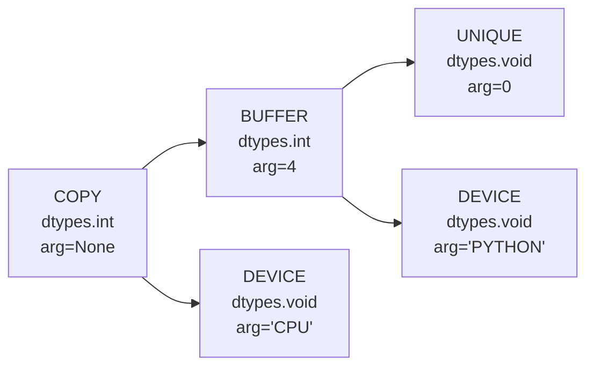
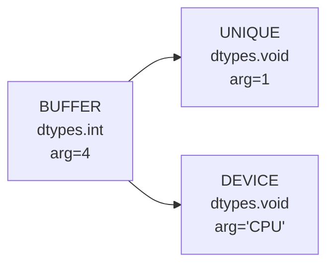
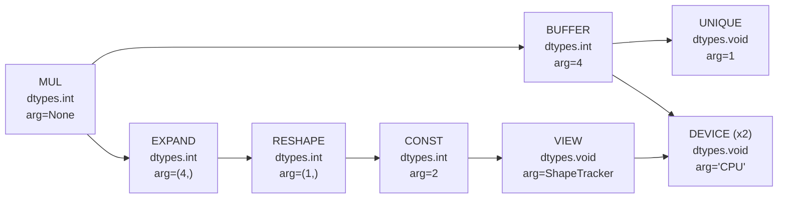
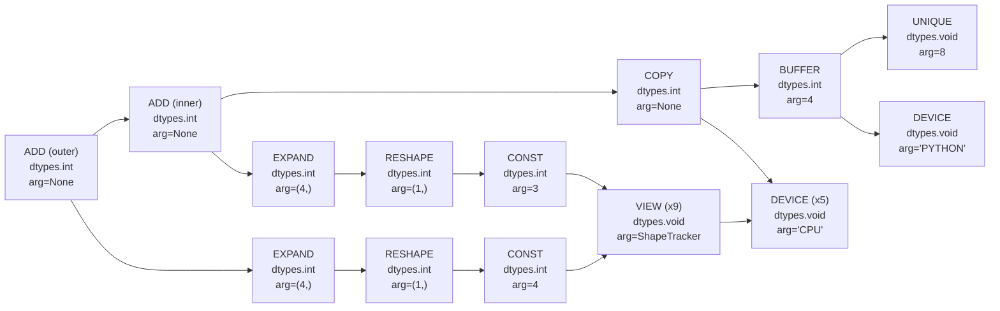
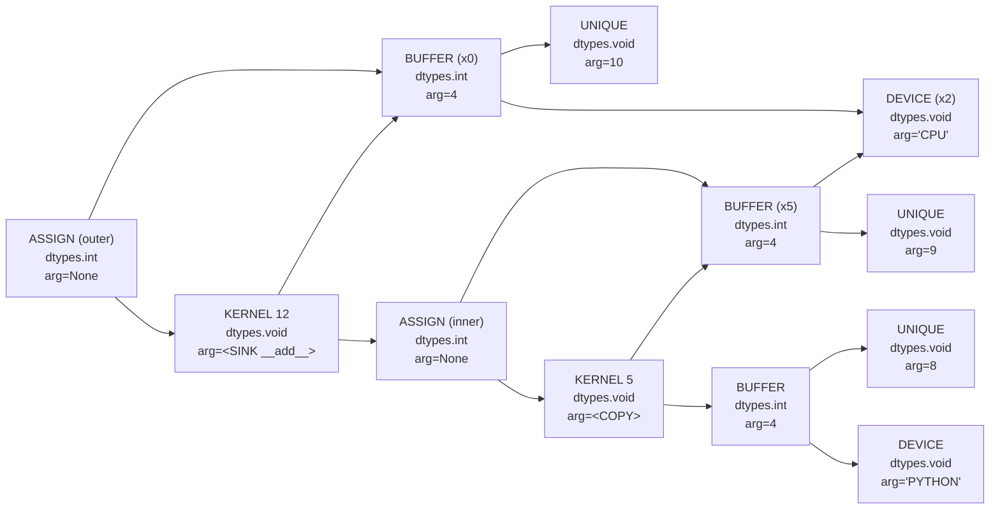
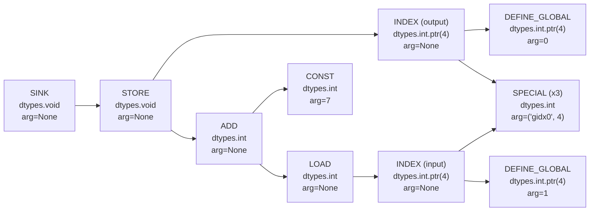

# Introduction to Tinygrad

Understanding Tinygrad can be hard, even Karpathy is a bit confused about it. This guide is my first attempt to navigate Tinygrad by synthesizing insights from official documentation and various livestreams.

<!-- more -->

<iframe width="720" height="320" src="https://www.youtube.com/embed/QUry9dHC-bk" frameborder="0" allowfullscreen></iframe>

## Why Tinygrad?

Tinygrad seems different from other mature frameworks such as [PyTorch], [JAX], and [TensorFlow] etc. But to me, what it seems appealing is that they want to democratize the petaflop as their core mission.

[PyTorch]: https://pytorch.org/
[JAX]: https://jax.readthedocs.io/en/latest/index.html
[TensorFlow]: https://www.tensorflow.org/

This is what I like about it:

1. Fully open source (_even its hiring process, but that's another story_)
2. No dependencies
3. Multiple backends
4. And a very tiny codebase

On the other hand, what I still don't like:

1. Steep learning curve, and not noob friendly
2. Hard to read code
3. Not the best documentation, and some broken examples
4. It's not stable yet, but soon will be

But let's start coding.

## Installation

Tinygrad is designed to be hackable from the ground up. The recommended installation uses the editable `-e` flag from pip, allowing you to edit the source code and see changes right away.

```bash
git clone https://github.com/Tinygrad/Tinygrad.git
cd Tinygrad
python3 -m pip install -e .
```

## The Tensor

Let's start with something familiar, thanks to Pytorch-like API, creating and manipulating tensors:

```python
from tinygrad import Tensor

t = Tensor([1, 2, 3, 4])
print(t)

# Basic operations work as expected
doubled = t * 2
print(doubled.tolist())  # [2, 4, 6, 8]

# More complex operations
result = t + 3 + 4
print(result.tolist())   # [8, 10, 12, 14]
```

This looks familiar if you've used PyTorch or NumPy. But Tinygrad is doing something fundamentally different under the hood, let's explore what makes it special.

## The Devices

Tinygrad's first key concept is the Device, where Tensors are stored and compute is executed. There are multiple devices supported, including CPU, CUDA, METAL, and more. For example, on my Apple Silicon macbook, the default device is METAL:

```python
from tinygrad import Device

print(Device.DEFAULT)  # On Apple Silicon Mac: "METAL"
```

Tinygrad auto-detects the best available device on your system and makes it the default. This could be METAL (Apple Silicon), CUDA (NVIDIA), CPU, or other supported backends. The device abstraction allows the same code to run across different hardware.

You can override the default device:

```python
Device.DEFAULT = "CPU"
print(Device.DEFAULT)  # "CPU"
```

## Lazy Evaluation

Here's where Tinygrad becomes interesting. Let's examine what we actually created:

```python
from tinygrad import Tensor, dtypes

t = Tensor([1, 2, 3, 4])

# Examine the tensor properties
assert t.device == Device.DEFAULT
assert t.dtype == dtypes.int
assert t.shape == (4,)

print(t)
# <Tensor <UOp CPU (4,) int (<Ops.COPY: 7>, None)> on CPU with grad None>
```

_This Tensor has not been computed yet. Tinygrad is lazy - it builds a computational specification rather than immediately executing operations. The Tensor contains a chain of UOPs (micro-operations) that specify how to compute it when needed._

## The UOP

UOPs (micro-operations) are the core specification language in Tinygrad. They are immutable and form a [DAG] (Directed Acyclic Graph). Each UOP has an operation type, dtype, arguments, and source dependencies.

[DAG]: https://en.wikipedia.org/wiki/Directed_acyclic_graph

```python
print(t.uop)
```

You'll see something like:

```python
UOp(Ops.COPY, dtypes.int, arg=None, src=(
  UOp(Ops.BUFFER, dtypes.int, arg=4, src=(
    UOp(Ops.UNIQUE, dtypes.void, arg=0, src=()),
    UOp(Ops.DEVICE, dtypes.void, arg='PYTHON', src=()),)),
  UOp(Ops.DEVICE, dtypes.void, arg='CPU', src=()),))
```

This UOP tree specifies a COPY operation from a BUFFER on the PYTHON device (where our Python list `[1,2,3,4]` lives) to the CPU device. The UNIQUE identifier ensures unambiguous reference to this specific buffer.



## Realization

To execute the computational specification, we use the `realize()` method:

```python
t.realize()
print(t.uop)
```

After realization, the UOP changes fundamentally:

```python
UOp(Ops.BUFFER, dtypes.int, arg=4, src=(
  UOp(Ops.UNIQUE, dtypes.void, arg=1, src=()),
  UOp(Ops.DEVICE, dtypes.void, arg='CPU', src=()),))
```



The COPY operation has been replaced by a simple BUFFER reference. The UNIQUE identifier changed from `arg=0` to `arg=1`, indicating the data now exists as a new computational artifact on the target device.

## Operations build computation graphs

Let's see how operations create more complex graphs:

```python
t_times_2 = t * 2
print(t_times_2.uop)
```

This creates a UOP tree with a MUL operation. What appears as simple scalar multiplication becomes an explicit broadcasting specification:



**Understanding Broadcasting**: The scalar `2` is transformed through RESHAPE and EXPAND operations to match our Tensor's shape. This makes the computational intent explicit and optimizable.

We can verify the result:

```python
assert t_times_2.tolist() == [2, 4, 6, 8]
```

## Smart Deduplication

UOPs are both immutable and globally unique, leading to elegant computational deduplication:

```python
A = t * 4
B = t * 4

# Different Python objects
assert A is not B

# Same computational specification
assert A.uop is B.uop
```

When we realize one Tensor, both benefit from the shared computation:

```python
A.realize()

# Both tensors now point to the same realized buffer
assert A.uop is B.uop

print(B.tolist())  # [4, 8, 12, 16] - no computation needed
```

## Automatic Differentiation

Tinygrad includes automatic differentiation that operates on the same UOP principles. Let's see gradients in action:

```python
x = Tensor([2.0], requires_grad=True)
y = x**2 + 3*x + 1
loss = y.sum()

print(x.item()) # 2.0
print(y.item()) # 4 + 6 + 1 = 11
```

For the function $y = x^2 + 3x + 1$, the derivative is:

$$\frac{dy}{dx} = 2x + 3$$

At our input value $x = 2$:

$$\frac{dy}{dx}\bigg|_{x=2} = 2(2) + 3 = 7$$

Now let's compute the gradient using Tinygrad's automatic differentiation:

```python
grad, = loss.gradient(x)
print(grad.item()) # 7.0
```

### Chain Rule

Tinygrad automatically applies the chain rule:

```python
x = Tensor([2.0], requires_grad=True)
z = (x**2 + 1).log()
loss = z.sum()

print(x.item()) # 2.0
print(z.item()) # log(2^2 + 1) = log(5) ≈ 1.6094378232955933
```

For the composite function $z = \log(x^2 + 1)$, we need to apply the chain rule:

1. Let $z = \log(x^{2}+1)$.  
   Set $g(x)=x^{2}+1$. Then $z = \log(g(x))$.

2. Apply the chain rule:  
   $\frac{dz}{dx} = \frac{1}{g(x)} \cdot g'(x) = \frac{1}{x^2+1} \cdot 2x = \frac{2x}{x^2+1}$

3. Evaluate at $x=2$:  
   $\frac{dz}{dx}|_{x=2} = \frac{2 \cdot 2}{2^2+1} = \frac{4}{5} = 0.8$

Tinygrad handles all the chain rule complexity automatically:

```python
grad, = loss.gradient(x)
print(grad.item()) # 0.8
```

## Graph Optimization and Kernel Generation

Tinygrad's power lies in its graph rewrite system. Let's see optimization in action:

```python
t = Tensor([1, 2, 3, 4])
t_plus_3_plus_4 = t + 3 + 4

print(t_plus_3_plus_4.uop)  # Shows addition of 3 and 4 separately
```



The initial UOP tree shows two separate ADD operations. But when we prepare for kernel generation:

```python
t_plus_3_plus_4.kernelize()
print(t_plus_3_plus_4.uop)
```

The graph rewrite engine has optimized this to add 7 directly, demonstrating constant folding:



We can extract and examine the kernel AST:

```python
kernel_ast = t_plus_3_plus_4.uop.src[1].arg.ast

from tinygrad.codegen import full_rewrite_to_sink
rewritten_ast = full_rewrite_to_sink(kernel_ast)
print(rewritten_ast)
```



This shows the final optimized computation graph that will be compiled to device code.

### Generated Code

With `DEBUG=4`, we can see the actual generated kernel code:

```c
void E_4n2(int* restrict data0, int* restrict data1) {
  int val0 = *(data1+0);
  int val1 = *(data1+1);
  int val2 = *(data1+2);
  int val3 = *(data1+3);
  *(data0+0) = (val0+7);
  *(data0+1) = (val1+7);
  *(data0+2) = (val2+7);
  *(data0+3) = (val3+7);
}
```

When running with `DEBUG=2`, the `4` appears in yellow to indicate it's been upcasted. Running with `NOOPT=1` will show the unoptimized code with a loop:

```c
void E_4n2(int* restrict data0, int* restrict data1) {
  for (int ridx0 = 0; ridx0 < 4; ridx0++) {
    int val0 = *(data1+ridx0);
    *(data0+ridx0) = (val0+7);
  }
}
```

## Development and Debugging Tools

### Debug Flags

Tinygrad provides extensive debugging capabilities:

- `DEBUG=2` - Shows data movement and kernel execution
- `DEBUG=4` - Shows generated kernel code
- `VIZ=1` - Launches web-based graph rewrite explorer
- `NOOPT=1` - Disables optimizations for debugging

### Color Coding System

Tinygrad uses a color system in debug output to indicate optimization states:

- **Blue**: Global operations (e.g. `ADD`)
- **Light Blue**: Local operations (e.g. `COPY`)
- **Red**: Reduce operations (e.g. `SUM`)
- **Yellow**: Upcasted operations (e.g. `EXPAND`)
- **Purple**: Unrolled operations (e.g. `UNROLL`)
- **Green**: Group operations (e.g. `GROUP`)

### Visual Graph Explorer

You can explore Tinygrad's graph rewriting visually:

```bash
VIZ=1 python ramp.py
```

This launches a web-based graph rewrite explorer where you can see UOP transformations in real-time.

## Advanced Topics

### Low-Level UOP Construction

For complete understanding, you can construct UOPs directly:

```python
from tinygrad import dtypes
from tinygrad.uop import UOp, Ops

# Create constant UOPs
a = UOp(Ops.CONST, dtypes.int, arg=2)
b = UOp(Ops.CONST, dtypes.int, arg=2)

# Global uniqueness: same specifications = same object
assert a is b

# Construct computation
a_plus_b = a + b
print(a_plus_b)
```

This results in a UOP that adds two constants:

```python
UOp(Ops.ADD, dtypes.int, arg=None, src=(
  x0:=UOp(Ops.CONST, dtypes.int, arg=2, src=()),
   x0,))
```

### Pattern Matching and Graph Rewriting

Tinygrad's graph rewrite engine uses pattern matching for optimizations:

```python
from tinygrad.uop.ops import graph_rewrite, UPat, PatternMatcher
from tinygrad.uop import UOp, Ops

# Define a constant folding pattern
simple_pm = PatternMatcher([
  (UPat(Ops.ADD, src=(UPat(Ops.CONST, name="c1"), UPat(Ops.CONST, name="c2"))),
   lambda c1,c2: UOp(Ops.CONST, dtype=c1.dtype, arg=c1.arg+c2.arg)),
])

# Apply the pattern
a_plus_b_simplified = graph_rewrite(a_plus_b, simple_pm)
print(a_plus_b_simplified)  # UOp(Ops.CONST, dtypes.int, arg=4, src=())
```

Syntactic sugar makes patterns more readable:

```python
simpler_pm = PatternMatcher([
  (UPat.cvar("c1")+UPat.cvar("c2"), lambda c1,c2: c1.const_like(c1.arg+c2.arg))
])

assert graph_rewrite(a_plus_b, simple_pm) is graph_rewrite(a_plus_b, simpler_pm)
```

## Performance and Training

### Performance Expectations

You should expect competitive performance today. With `BEAM=2` optimization, Tinygrad often outperforms PyTorch on:

- Unoptimized workloads
- AMD hardware
- Training scenarios (20% faster than PyTorch on AMD in HLBC implementation)

### Training Philosophy

Tinygrad avoids the `trainer.fit()` abstraction. If you examine `examples/beautiful_mnist.py`, you'll find a complete MNIST trainer that contains everything you need and nothing you don't.

### Visual Graph Explorer

You can explore Tinygrad's graph rewriting visually:

```bash
VIZ=1 python ramp.py
```

Environment variables like `DEBUG=2` or `CPU=1` are set in bash like: `DEBUG=2 CPU=1 python docs/ramp.py`.

This launches a web-based graph rewrite explorer where you can see UOP transformations in real-time.

## Conclusion

You now understand Tinygrad's core concepts: how UOPs transform through graph rewrites to create optimized computational kernels. The beauty lies not in each line being simple, but in the whole system being maintainable by small groups of smart engineers, and you can be one of them.

## Glossary

| Term | Meaning |
| --- | --- |
| Device | Hardware backend where tensors live and kernels run (e.g. `CPU`, `CUDA`, `METAL`). |
| Lazy / Realize | Tinygrad records operations lazily; `realize()` forces execution. |
| UOp | Immutable micro-operation node in the computation graph. |
| DAG | Directed acyclic graph composed of UOps. |
| Kernelize | Transformation that groups UOps into executable kernels. |
| ShapeTracker | Tracks tensor views/shapes without copying data. |
| Upcast | Optimisation that widens ops to work on multiple elements at once. |
