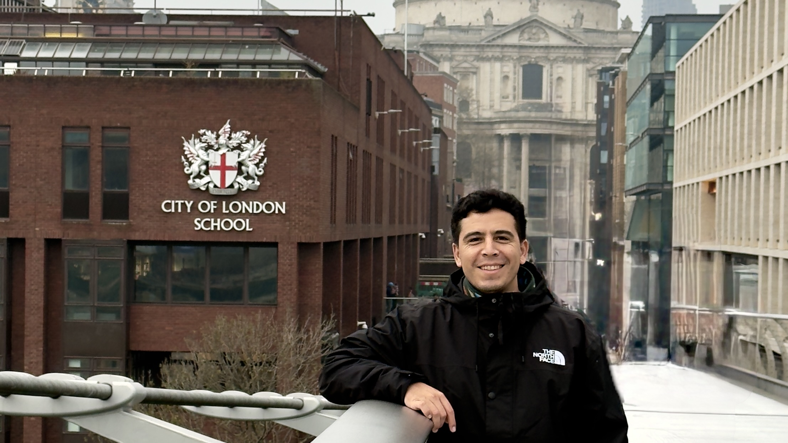

# Hello, I'm Omar

 I’m a software engineer specializing in artificial intelligence and machine learning, with strong interests in interpretability, alignment, and agentic systems. I build AI-powered products, explore how digital and biological brains work, and help startups find product–market fit. Open to long-term moonshots and selective consulting engagements.

## What I work on

1. _Building production-ready AI/ML systems (Agents, RAG, Evals, etc.)_
2. _Consulting and training in AI/ML for startups_
3. _Creating technical content and developer docs_
4. _Conducting domain-specific research_

Fun fact: I once worked as a [music](https://open.spotify.com/artist/5e6x7QJXOGbkDEPpEOWm1w) [producer](https://music.apple.com/us/artist/1600939432) and YouTube [content](https://www.youtube.com/watch?v=kFlLzFuslfQ) [creator](https://www.youtube.com/watch?v=ISa10TrJK7w). In my free time you can find me making beats, learning Mandarin (你好), or exploring new places around the world.

## Let's Connect

Reach out via [X], [LinkedIn], or [omar@olivares.cl] to discuss your next project or just to chat about tech.

[X]: https://twitter.com/omarnomad
[LinkedIn]: https://www.linkedin.com/in/ofou
[omar@olivares.cl]: mailto:omar@olivares.cl
